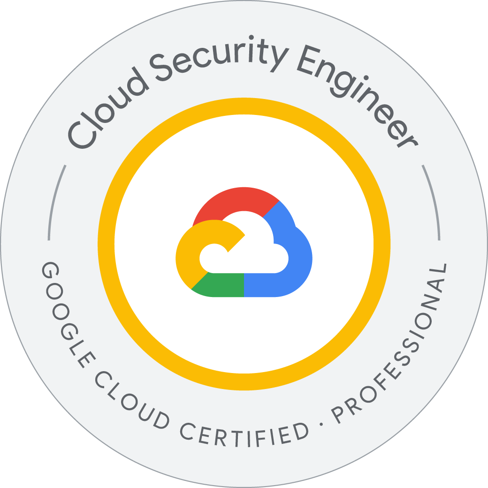
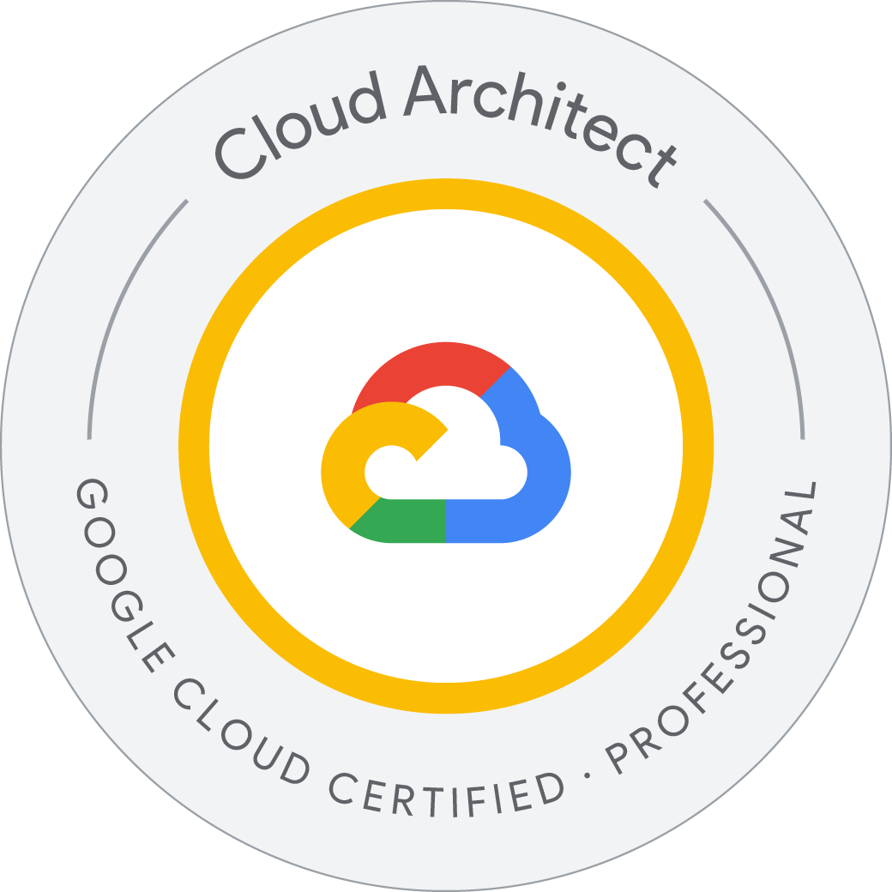

# Enterprise Search / Full-Stack / GCP Security Engineer

Solr / Kotlin / Java / TypeScript / Vue / Angular / Google Cloud Security

## What I can deliver

- Enterprise search PoC / internal search systems
- Full-stack web application development
- Search UI development with TypeScript, Vue, Angular
- Backend API development with Kotlin / Java
- Google Cloud architecture and security review
- CI/CD, testing, maintenance and operation

## Featured Projects

### Enterprise Search Demo
Solr + Kotlin API + TypeScript frontend.
Includes full-text search, faceted search, test cases, CI/CD and deployment notes.

### GCP Secure Full-Stack Template
Secure application architecture on Google Cloud.
Includes IAM design, Secret Manager, logging, monitoring and deployment workflow.

### Excel XML / POM Parser
Tooling for analyzing structured business files using C#.

## Tech Stack

- Frontend: TypeScript, JavaScript, Vue, Angular, HTML, CSS
- Backend: Kotlin, Java, C#
- Search: Apache Solr
- Cloud: Google Cloud
- DevOps: CI/CD, testing, monitoring
- AI/ML: preprocessing, evaluation, paper reading, model validation

## Certifications

## GitHub Stats

